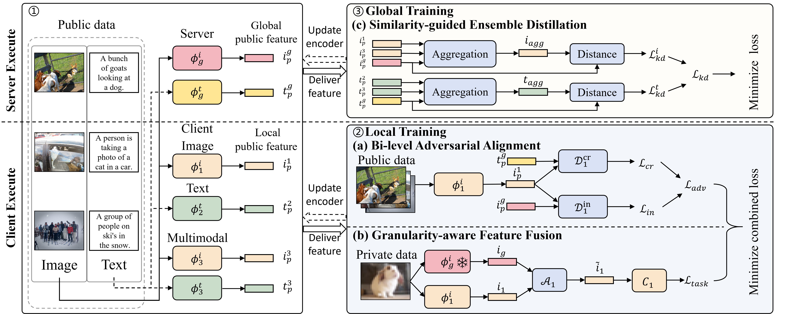

# FedAFD: Multimodal Federated Learning via Adversarial Fusion and Distillation

This repository is PyTorch implementation of the paper FedAFD: Multimodal Federated Learning via Adversarial Fusion and Distillation(CVPR 2026).



## Requirements
"requirements.txt file will coming soon."

## Datasets Structure

```text
'FedAFD/data/'
├── AG_NEWS
│   ├── train.csv
│   └── test.csv
├── cifar100
│   └── cifar-100-python
├── flickr30k
│   └── flickr30k-images
├── mmdata
│   ├── MSCOCO
│   │   └── 2014
│   │       ├── allimages
│   │       ├── annotations
│   │       ├── train2014
│   │       └── val2014
```

## Usage

```
cd FedAFD
nohup python src/fedafd.py --name 1_iid_fedafd --partition homo --server_lr 1e-5 --BAA --agg_method SED &
```

##  Acknowledgement


The implementation of this repository is based on the open-source project [CreamFL](https://github.com/FLAIR-THU/CreamFL).


